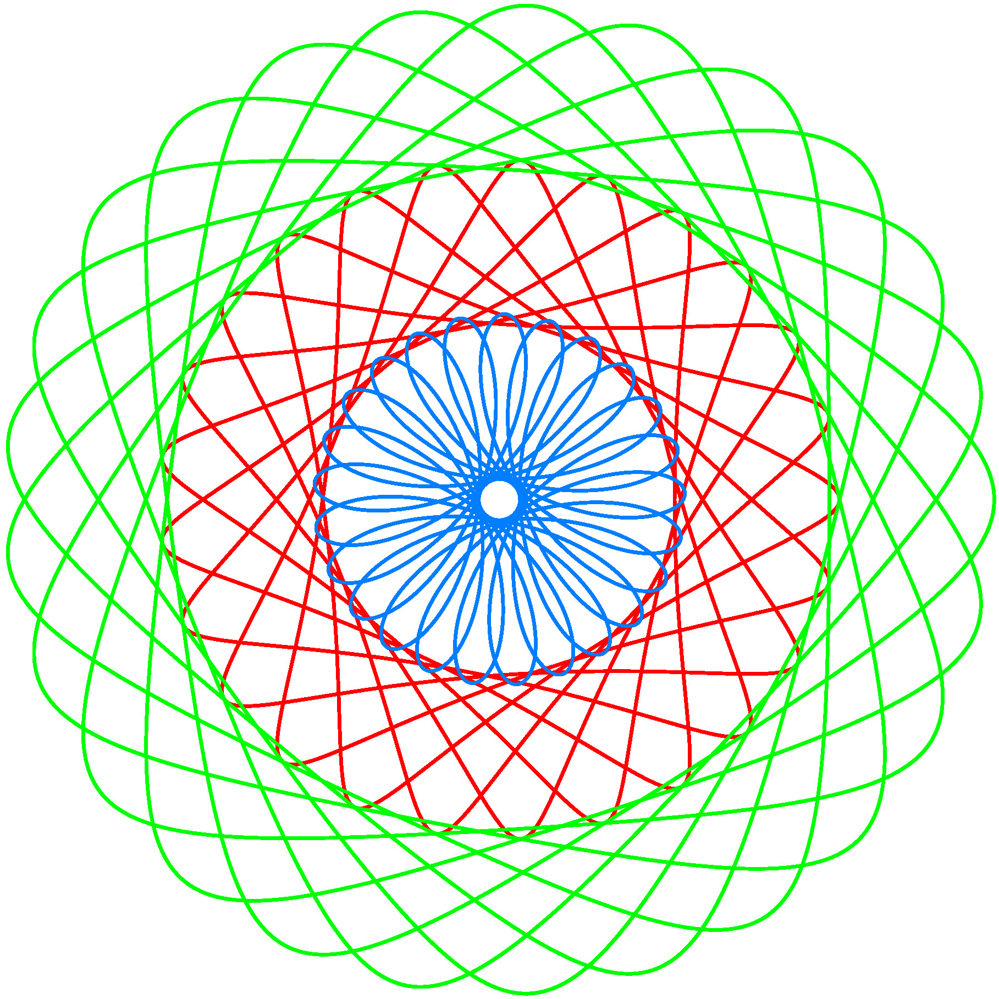
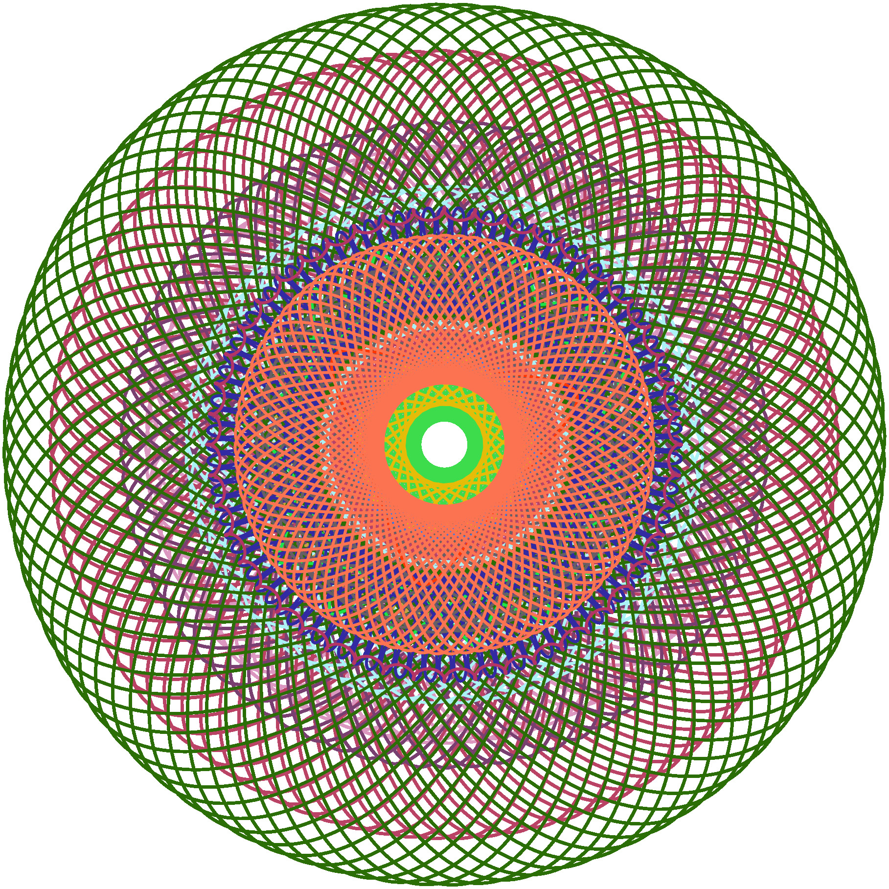
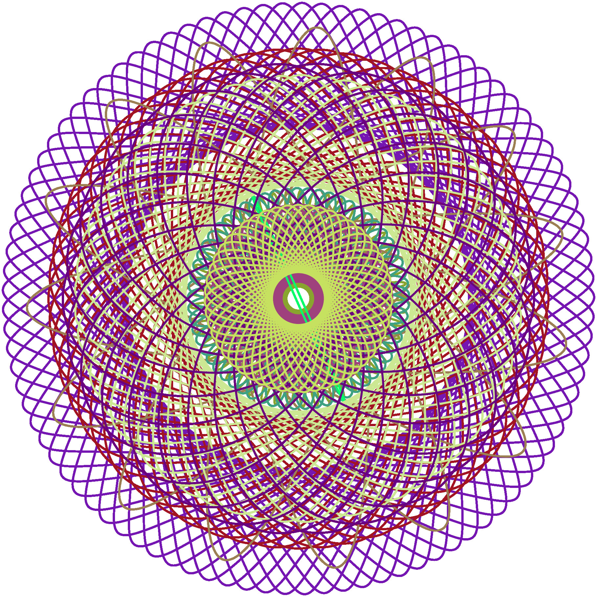
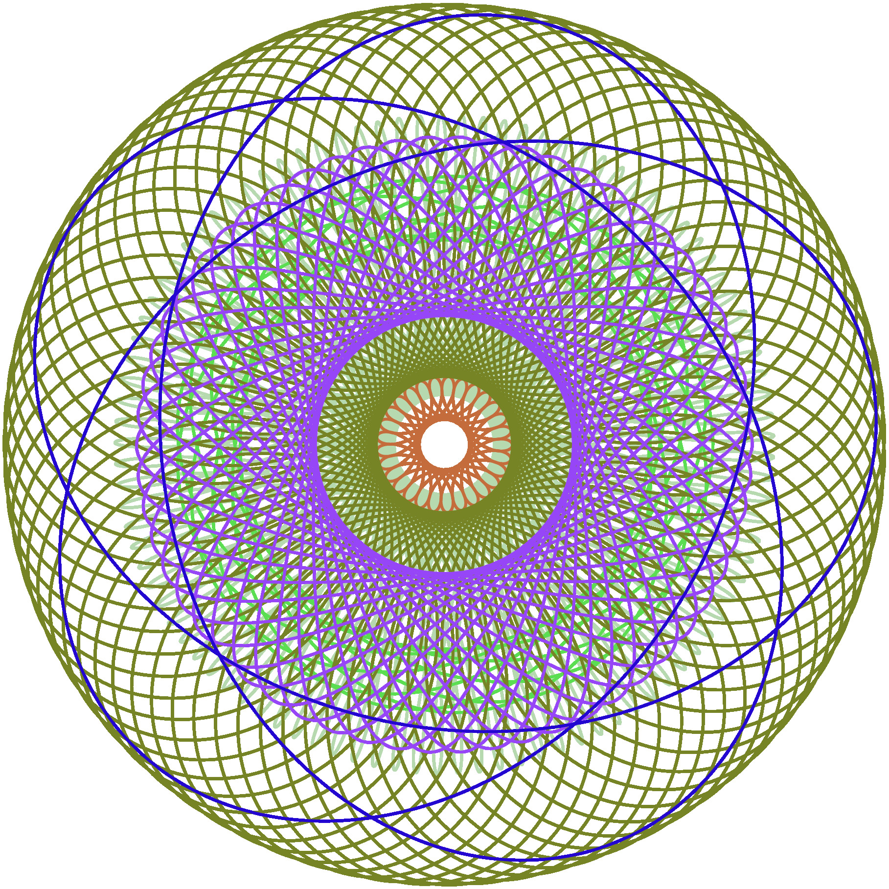
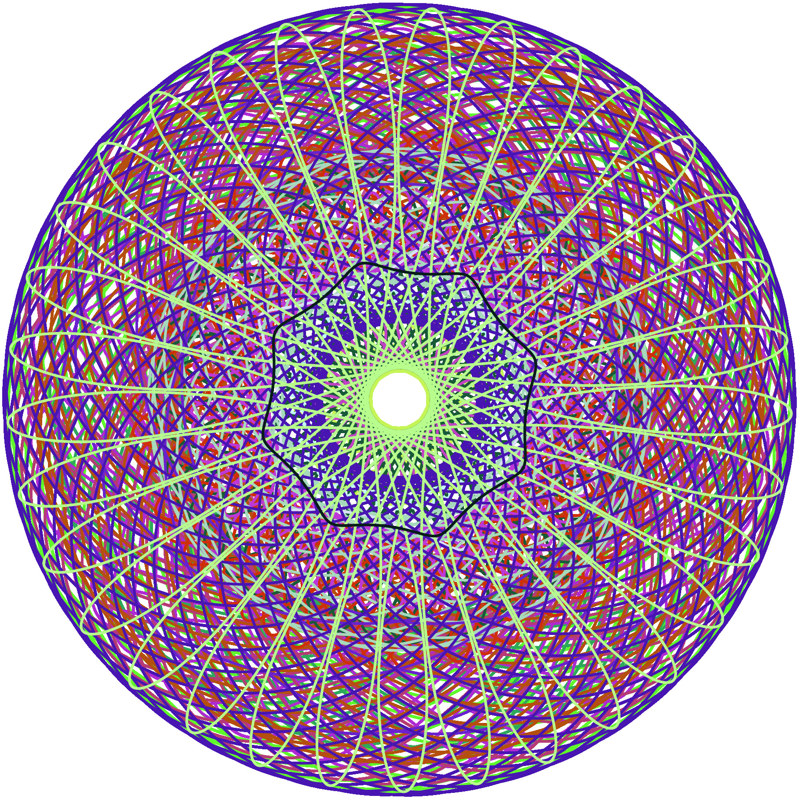

# Spiro
### Jacob Malloy - jmalloy1
For this project I did the suggested project of the spirograph. To do this I followed the equations on [this Page](https://en.wikipedia.org/wiki/Hypotrochoid). The input parameters can be specified in a space delimeted input stream with all of the values described below. The input should have a multiple of 9 values in it, and each set of parameters will be drawn from the top to the bottom. 
| R | r | d | total steps | steps | offset angle | red | green |blue |
| --- | --- | --- | ---- | ---- | ---- | ----- | ---- | ---- |
| Radius of the bigger circle | Radius of the inner circle | Length of pen away from center of small circle | Total steps to take | Step to render up to | starting offset angle | Red value | Green value | Blue value |
| int | int | int | int | int(0-total steps) | double(degrees) | int(0-255) | int(0-255) | int(0-255) |
## Compiling
Build the program and generate jpgs of the five examples plus one random jpg.
`make`
Build just the program without producing the jpg's
`make spiro`
## Video
I wanted to play with using ffmpeg to make a video and the video I made can be found [here](https://youtu.be/gcawb_v6neg). I have also included a [video.sh](video.sh), but I really do not recommend running it. The script will spawn 3,125 spiro,jgraph, and convert processes. It will create a 5.1 Gb folder of the jpg's. The script took 1 minute 49 seconds to generate all of the pictures on my Ryzen 9 5950x machine. The `ffmpeg` portion took 1 minute 22 seconds. 
## Random
When I finished writing the program, I had used one test case for all of my work, and then didn't know how to make interesting examples, so I wrote [random_gen.py](random_gen.py) for my own use, but included it since it can produce interesing results. The [random_gen.py](random_gen.py) script is run in the makefile, but I also included 5 other examples since the random one is often not very interesting.
## Examples

